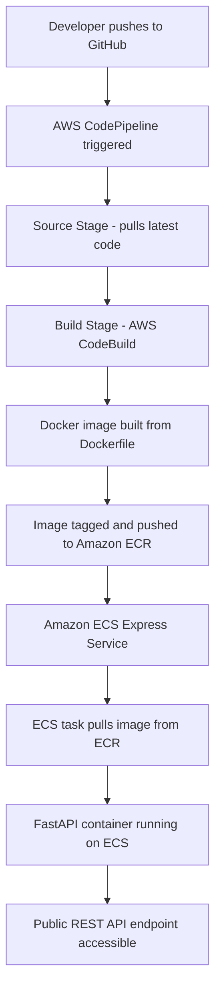
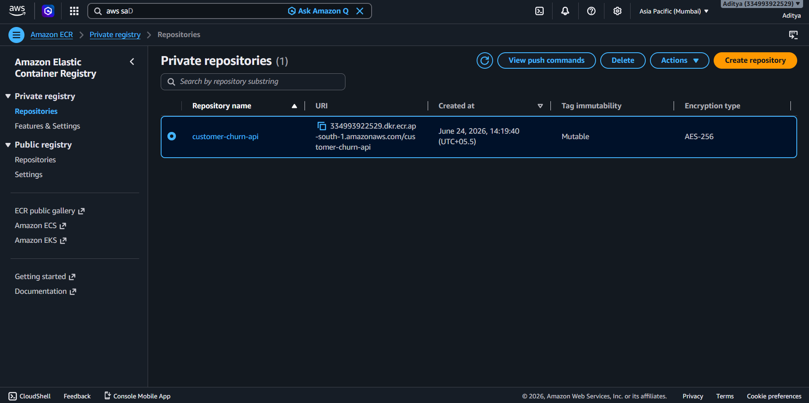
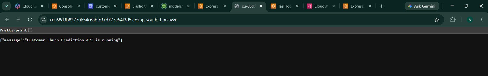

<div align="center">

#  Customer Churn Prediction MLOps Pipeline on AWS

### End-to-End Machine Learning Deployment with CI/CD Automation

A production-ready Machine Learning Operations (MLOps) pipeline that trains a Customer Churn Prediction model, containerizes it using Docker, stores images in Amazon ECR, and automatically deploys updates to Amazon ECS using AWS CodePipeline and CodeBuild.

<br>


<br>

> **"Automated Machine Learning deployment pipeline using Docker, Amazon ECR, Amazon ECS, AWS CodeBuild, and AWS CodePipeline."**

<br>


</div>

---


## Table of Contents

1. [Project Overview](#1-project-overview)
2. [Problem Statement](#2-problem-statement)
3. [Business Impact](#3-business-impact)
4. [Technology Stack](#4-technology-stack)
5. [Architecture Diagram](#5-architecture-diagram)
6. [Project Structure](#6-project-structure)
7. [Dataset Description](#7-dataset-description)
8. [Exploratory Data Analysis](#8-exploratory-data-analysis)
9. [Feature Engineering](#9-feature-engineering)
10. [Model Training](#10-model-training)
11. [Model Evaluation](#11-model-evaluation)
12. [FastAPI Development](#12-fastapi-development)
13. [Docker Containerization](#13-docker-containerization)
14. [Amazon ECR Integration](#14-amazon-ecr-integration)
15. [AWS CodeBuild](#15-aws-codebuild)
16. [AWS CodePipeline](#16-aws-codepipeline)
17. [Amazon ECS Express Service Deployment](#17-amazon-ecs-express-service-deployment)
18. [Deployment Challenges and Solutions](#18-deployment-challenges-and-solutions)
19. [API Testing](#19-api-testing)
20. [Results](#20-results)
21. [Resume Highlights](#21-resume-highlights)
22. [Future Improvements](#22-future-improvements)
23. [Conclusion](#23-conclusion)

---

## 1. Project Overview

This project demonstrates a production-grade, end-to-end MLOps pipeline for predicting customer churn in the telecommunications industry. It covers the complete lifecycle of a machine learning system — from raw data exploration and model training to containerized deployment and automated CI/CD pipelines on AWS cloud infrastructure.

The central goal of this project is not just to build an accurate machine learning model, but to operationalize it in a way that mirrors real-world engineering standards. Every component — from the REST API to the cloud deployment pipeline — has been designed with production readiness, scalability, and maintainability in mind.

The project brings together machine learning engineering, software development, and cloud infrastructure to deliver a fully functional, publicly accessible prediction service. When a new commit is pushed to GitHub, an automated pipeline builds the Docker image, pushes it to Amazon ECR, and deploys the updated service to Amazon ECS — with no manual intervention required.

**Core capabilities of this project:**

- Predict whether a telecom customer is likely to churn based on behavioral and account attributes
- Serve predictions through a REST API built with FastAPI
- Package the entire service inside a Docker container for environment consistency
- Store container images in Amazon ECR with version tracking
- Automate image builds using AWS CodeBuild triggered by GitHub commits
- Orchestrate the full CI/CD flow using AWS CodePipeline
- Deploy and run the containerized API on Amazon ECS Express Service
- Monitor container health, logs, and task failures through CloudWatch (integrated within ECS)

---

## 2. Problem Statement

Customer churn is one of the most critical operational challenges facing telecommunications companies. Every month, a segment of the customer base discontinues their service — either by switching to a competitor or simply canceling. Acquiring a new customer costs five to seven times more than retaining an existing one, which makes churn prediction not just a data science exercise, but a direct business priority.

The challenge lies in identifying at-risk customers before they leave. Customer churn is rarely sudden — it is usually preceded by patterns in account behavior, service usage, billing history, and contract structure. If these patterns can be detected early enough, retention teams can intervene proactively with targeted offers, service improvements, or direct outreach.

This project builds a supervised binary classification model trained on historical customer data. Given a set of customer attributes as input, the model predicts whether that customer is likely to churn (label 1) or remain (label 0). The prediction is then exposed through a REST API, making it accessible to downstream applications such as CRM systems, retention dashboards, or automated alert pipelines.

**Input features used for prediction:**

- Tenure (how long the customer has been with the company)
- Monthly charges
- Total charges accumulated over the customer lifetime
- Contract type (month-to-month, one year, two year)
- Internet service type (DSL, Fiber optic, None)
- Payment method (electronic check, mailed check, bank transfer, credit card)
- Senior citizen status
- Whether the customer has dependents

**Output:**

- `0` — Customer is not predicted to churn
- `1` — Customer is predicted to churn

---

## 3. Business Impact

The value of a churn prediction system extends well beyond model accuracy metrics. When deployed correctly as part of a business workflow, it creates measurable impact across multiple dimensions.

**Revenue protection:** Identifying high-risk customers before they churn allows retention teams to engage proactively. Even reducing churn by a small percentage across a large customer base can translate into millions in preserved annual recurring revenue.

**Operational efficiency:** Rather than applying blanket retention campaigns to the entire customer base, predictions allow teams to focus their resources where the risk is highest. This reduces cost-per-intervention and improves campaign return on investment.

**Customer experience:** Proactive outreach based on churn signals — such as offering a plan upgrade or resolving a billing concern — can improve perceived service quality and overall customer satisfaction.

**Scalability of decision-making:** Once the prediction service is deployed on AWS ECS, it can handle prediction requests at scale without manual effort. Any application or internal tool can integrate with the REST API to retrieve churn predictions in real time.

**Automation-first engineering:** The CI/CD pipeline built with CodeBuild and CodePipeline ensures that model updates, bug fixes, and API changes are deployed automatically whenever the codebase changes. This eliminates manual deployment steps and reduces the risk of human error in production releases.

---

## 4. Technology Stack

### Machine Learning

| Tool | Purpose |
|---|---|
| Python 3.10+ | Core programming language |
| Pandas | Data loading, cleaning, and manipulation |
| NumPy | Numerical operations and array handling |
| Scikit-Learn | Model training, encoding, and evaluation |
| Joblib | Model serialization and artifact persistence |

### API Development

| Tool | Purpose |
|---|---|
| FastAPI | High-performance REST API framework |
| Uvicorn | ASGI server to run FastAPI in production |

### Containerization

| Tool | Purpose |
|---|---|
| Docker | Container image creation and runtime packaging |

### AWS Cloud Services

| Service | Purpose |
|---|---|
| Amazon ECR | Container image registry |
| Amazon ECS Express Service | Managed container orchestration and deployment |
| AWS CodeBuild | Automated Docker image build and ECR push |
| AWS CodePipeline | End-to-end CI/CD pipeline orchestration |


### Version Control

| Tool | Purpose |
|---|---|
| Git | Local version control |
| GitHub | Remote repository and CI/CD source trigger |

---

## 5. Architecture Diagram

The following diagram shows the complete flow from a developer's GitHub commit to a publicly running FastAPI container on AWS ECS.



**Pipeline Summary:**

- Every GitHub commit triggers an automatic pipeline run
- CodeBuild handles Docker image construction and ECR upload
- ECS pulls the latest image and deploys it as a running task
- The FastAPI service becomes publicly accessible through the ECS endpoint

---

## 6. Project Structure

```text
Customer-Churn/
│
├── app.py                        # FastAPI application with prediction endpoints
├── requirements.txt              # Python package dependencies
├── Dockerfile                    # Docker image build instructions
├── .gitignore                    # Files and patterns excluded from Git tracking
│
├── models/
│   ├── churn_model.pkl           # Trained and serialized machine learning model
│   └── feature_columns.pkl       # Serialized list of expected feature columns
│
├── notebooks/
│   └── churn_eda.ipynb           # Jupyter notebook for EDA and model training
│
├── deployment/
│   └── ecr-buildspec.yml         # CodeBuild build specification for ECR pipeline
│
└── README.md                     # Project documentation
```

**Key file descriptions:**

- `app.py` — The main FastAPI application that loads the trained model artifacts and exposes prediction endpoints. This is the entry point of the deployed service.
- `requirements.txt` — Declares all Python dependencies needed to run the API, including fastapi, uvicorn, scikit-learn, and joblib.
- `Dockerfile` — Defines how the application is packaged into a Docker container, including the base image, dependency installation, and application startup command.
- `models/churn_model.pkl` — The serialized Random Forest classifier trained on the telecom churn dataset.
- `models/feature_columns.pkl` — The serialized list of feature column names used during training, ensuring that the prediction API receives and processes input in the correct format.
- `notebooks/churn_eda.ipynb` — The exploratory data analysis and model training notebook, documenting every step from raw data to trained model artifacts.
- `deployment/ecr-buildspec.yml` — The build specification file used by AWS CodeBuild to build the Docker image and push it to Amazon ECR.

---

## 7. Dataset Description

The dataset used in this project is the publicly available IBM Telco Customer Churn dataset, widely used as a benchmark for binary classification problems in the telecommunications domain.

**Dataset characteristics:**

- Approximately 7,000 customer records
- 20 input features covering demographics, account information, and service subscriptions
- 1 binary target variable: `Churn` (Yes/No)

**Feature categories:**

| Category | Features |
|---|---|
| Demographics | Gender, SeniorCitizen, Partner, Dependents |
| Account info | Tenure, Contract, PaperlessBilling, PaymentMethod |
| Services | PhoneService, MultipleLines, InternetService, OnlineSecurity, TechSupport, StreamingTV |
| Billing | MonthlyCharges, TotalCharges |

The target variable `Churn` is converted to a binary numeric label during preprocessing: `Yes` becomes `1` (customer churned) and `No` becomes `0` (customer retained). The dataset presents a class imbalance — approximately 26% of records are churners, which is accounted for during model evaluation by using metrics beyond simple accuracy.

---

## 8. Exploratory Data Analysis

Before any model training begins, a thorough exploratory data analysis is performed to understand the structure and distribution of the dataset, identify data quality issues, and uncover relationships between features and the target variable.

**Dataset overview and data types:**

The first step involves loading the dataset and inspecting column data types. The `TotalCharges` column, despite representing a numeric billing value, is loaded as an object type due to the presence of whitespace strings for new customers with zero charges. This requires explicit conversion and null handling before any downstream processing.

**Missing value treatment:**

After converting `TotalCharges` to a numeric type, rows with missing or invalid values are dropped. The dataset is largely clean, with missing values appearing only in this one column. The small number of affected rows (approximately 11) is negligible relative to the total dataset size, and simple row removal is sufficient.

**Churn distribution:**

The churn label distribution reveals a significant class imbalance. Roughly 73% of customers did not churn, while 27% did. This imbalance informs the choice of evaluation metrics — relying solely on accuracy would be misleading, as a model that always predicts "No Churn" would achieve 73% accuracy without learning anything useful. Precision, recall, and the F1 score are therefore prioritized during model evaluation.

**Feature distributions:**

- Customers with month-to-month contracts churn at a much higher rate than those on one-year or two-year contracts
- Customers using Fiber Optic internet service churn more frequently than those using DSL or no internet
- Higher monthly charges correlate with higher churn likelihood
- Customers with shorter tenure are significantly more likely to churn than long-tenured customers
- Senior citizens exhibit a higher churn rate relative to non-senior customers

**Correlation analysis:**

Numeric features are examined for their correlation with the churn label. Monthly charges and total charges show notable correlation with tenure, which is expected — longer-tenured customers naturally accumulate higher total charges. This multicollinearity is handled by examining feature importance post-training rather than pre-emptively removing correlated features.

## Exploratory Data Analysis

<table>
<tr>
<td width="50%">

### Churn Distribution


</td>
<td width="50%">

### Contract vs Churn


</td>
</tr>
</table>

<table>
<tr>
<td width="50%">

### Feature Importance


</td>
<td width="50%">

### Shap Summary


</td>
</tr>
</table>

---

## 9. Feature Engineering

Raw data cannot be fed directly into a scikit-learn classifier. Several preprocessing steps are applied to transform the dataset into a suitable numeric format.

**Label encoding the target variable:**

The `Churn` column contains string values `Yes` and `No`. These are mapped to integer values `1` and `0` respectively using pandas `map()` before any splitting or transformation occurs.

**Dropping irrelevant columns:**

The `customerID` column is a unique identifier with no predictive value. It is dropped prior to encoding to prevent it from influencing the model.

**One-hot encoding categorical variables:**

All categorical features — such as `Contract`, `InternetService`, `PaymentMethod`, `gender`, and others — are converted into numeric dummy variables using `pd.get_dummies()`. This expands each categorical column into a set of binary columns, one per unique category, allowing the classifier to interpret these features numerically.

**Feature column persistence:**

After one-hot encoding, the exact list of feature columns is saved using Joblib as `feature_columns.pkl`. This step is critical. When the trained model is later loaded in the FastAPI service, incoming prediction requests must be transformed into the same column structure the model was trained on. Without this file, there would be no reliable way to ensure consistency between training-time and inference-time feature representations.

Any new data submitted for prediction is passed through the same encoding logic, and then reindexed against the saved feature columns — filling any missing columns with zero — before being passed to the model.

---

## 10. Model Training

**Train-test split:**

The preprocessed dataset is split into training and test sets using an 80/20 ratio with a fixed random seed for reproducibility. Stratification is applied during splitting to ensure that the class distribution in both sets reflects the overall dataset balance.

**Model selection:**

A Random Forest classifier is selected for this task. Random Forest is an ensemble learning method that builds multiple decision trees during training and aggregates their outputs at inference time. It handles mixed feature types well, is robust to outliers, and provides feature importance scores that are useful for interpretability and debugging. It also performs reliably on tabular classification tasks without extensive hyperparameter tuning.

**Training:**

The model is fit on the training features and labels. Default hyperparameters are used as a baseline, with `n_estimators=100` decision trees in the ensemble.

**Model and feature column persistence:**

After training, two files are serialized using `joblib.dump()`:

```python
joblib.dump(model, "models/churn_model.pkl")
joblib.dump(feature_columns, "models/feature_columns.pkl")
```

Both files are essential to the prediction service:

- `churn_model.pkl` — contains the trained classifier. Without it, no predictions can be made.
- `feature_columns.pkl` — contains the ordered list of feature names the model was trained on. Without it, there is no way to guarantee that inference-time input aligns with the feature space the model expects.

These two files together represent the complete, portable model artifact that gets packaged into the Docker image and deployed on ECS.

---

## 11. Model Evaluation

Model performance is evaluated on the held-out test set using a suite of classification metrics that account for class imbalance.

| Metric | Description |
|---|---|
| Accuracy | Proportion of total correct predictions |
| Precision | Of all predicted churners, how many actually churned |
| Recall | Of all actual churners, how many were correctly predicted |
| F1 Score | Harmonic mean of precision and recall |
| Confusion Matrix | Breakdown of true positives, false positives, true negatives, false negatives |

Recall is treated as the most operationally important metric for this problem. A false negative — predicting that a customer will not churn when they actually will — is more costly than a false positive, because missed churners represent lost revenue with no intervention opportunity. A model that errs on the side of flagging more customers as potential churners is more useful in a retention context.

The trained XG Boost model achieves strong baseline performance on this dataset, with F1 scores well above naive baseline classifiers, justifying its selection for deployment.

---

## 12. FastAPI Development

FastAPI is chosen as the web framework for exposing the churn prediction model as a REST API. It is one of the fastest Python web frameworks available, supports automatic API documentation through Swagger UI, provides built-in data validation through Pydantic, and integrates naturally with async Python patterns.

**Model loading:**

When the FastAPI application starts, it loads both model artifacts from disk once at startup:

```python
import joblib

model = joblib.load("models/churn_model.pkl")
feature_columns = joblib.load("models/feature_columns.pkl")
```

Loading the model at startup — rather than at each request — ensures that inference latency remains minimal. The model lives in memory for the lifetime of the server process.

**Input schema:**

A Pydantic model defines the expected structure of prediction requests. FastAPI uses this schema to automatically validate incoming JSON payloads and return descriptive errors if required fields are missing or have incorrect types.

```python
from pydantic import BaseModel

class CustomerFeatures(BaseModel):
    tenure: int
    MonthlyCharges: float
    TotalCharges: float
    SeniorCitizen: int
    Dependents: str
    Contract: str
    InternetService: str
    PaymentMethod: str
```

### GET /

The root endpoint serves as a health check, confirming that the API is running and reachable.

**Response:**

```json
{
  "message": "Customer Churn Prediction API is running"
}
```

This endpoint is useful for load balancer health checks, uptime monitoring, and basic service verification after deployment.

### POST /predict

The prediction endpoint accepts a JSON body containing customer features, preprocesses the input to match the training feature space, and returns a binary prediction.

**Request body:**

```json
{
  "tenure": 12,
  "MonthlyCharges": 65.5,
  "TotalCharges": 786.0,
  "SeniorCitizen": 0,
  "Dependents": "No",
  "Contract": "Month-to-month",
  "InternetService": "Fiber optic",
  "PaymentMethod": "Electronic check"
}
```

**Response — No Churn:**

```json
{
  "prediction": 0
}
```

**Response — Churn Predicted:**

```json
{
  "prediction": 1
}
```

**Prediction logic:**

Inside the endpoint, the incoming request data is converted into a pandas DataFrame, one-hot encoded to match the training feature structure, reindexed against the saved `feature_columns` list, and passed to the model's `predict()` method. The integer result is returned directly in the response.

The automatic Swagger UI documentation is available at `/docs` when the service is running, providing an interactive interface for testing the API without any additional tooling.

---

## 13. Docker Containerization

Docker is used to package the FastAPI application, its dependencies, and the trained model artifacts into a single, portable container image. This eliminates environment inconsistency between local development and cloud deployment — the container runs identically whether on a developer laptop or an ECS task.

**Why Docker:**

Without containerization, deploying a Python application to a cloud environment requires manually configuring the server's operating system, Python version, package dependencies, and file structure. Docker encapsulates all of these concerns inside an image that can be built once and run anywhere that supports the Docker runtime.

**Dockerfile breakdown:**

```dockerfile
FROM python:3.10-slim

WORKDIR /app

COPY requirements.txt .
RUN pip install --no-cache-dir -r requirements.txt

COPY . .

EXPOSE 8000

CMD ["uvicorn", "app:app", "--host", "0.0.0.0", "--port", "8000"]
```

- `FROM python:3.10-slim` — Uses a minimal Python base image to keep the final image size small
- `WORKDIR /app` — Sets the working directory inside the container
- `COPY requirements.txt .` followed by `RUN pip install` — Installs Python dependencies as a separate layer for Docker build cache efficiency
- `COPY . .` — Copies the entire project (including the `models/` directory with the `.pkl` files) into the container
- `EXPOSE 8000` — Documents that the container listens on port 8000
- `CMD` — Starts the Uvicorn server, binding to all network interfaces so the container is accessible from outside

**Building and running locally:**

```bash
docker build -t customer-churn-api .
docker run -p 8000:8000 customer-churn-api
```
## Docker Engine


After running these commands, the API is accessible at `http://localhost:8000`. The container includes everything needed — Python runtime, installed packages, model artifacts — and nothing beyond what is necessary.

---

## 14. Amazon ECR Integration

Amazon Elastic Container Registry (ECR) is a fully managed Docker container registry provided by AWS. It is used in this project to store, version, and serve the Docker images built by CodeBuild to ECS for deployment.

**Why ECR:**

When ECS needs to start a new container task, it must pull the Docker image from a registry. While Docker Hub is a publicly available option, ECR offers several advantages in an AWS-native deployment context:

- Native integration with ECS, CodeBuild, and IAM — no external authentication configuration required
- Images are stored in the same AWS region as the deployment, reducing pull latency
- Built-in image vulnerability scanning
- Private by default, ensuring that only authorized AWS services can access the images
- Image tags and digest tracking provide clear versioning history

**Image versioning:**

Each image pushed to ECR is tagged, typically with the CodeBuild build ID or a commit hash. This creates a traceable history of deployments, making it straightforward to identify which image version is running in production or to roll back to a previous build if needed.

## Amazon ECR Repository




## ECR Images


---

## 15. AWS CodeBuild

AWS CodeBuild is a fully managed continuous integration service that compiles source code, runs tests, and produces deployable artifacts. In this project, CodeBuild is responsible for building the Docker image from the project's Dockerfile and pushing it to the ECR repository.

**Build process overview:**

When triggered by CodePipeline (which itself is triggered by a GitHub commit), CodeBuild reads the `ecr-buildspec.yml` file from the repository root. This file defines the sequence of commands that CodeBuild executes inside a managed build environment.

**Buildspec workflow:**

The `ecr-buildspec.yml` file contains four phases:

1. **Pre-build:** Authenticate with Amazon ECR using the AWS CLI. This step uses the CodeBuild execution role's IAM permissions to retrieve a temporary Docker login token and authenticate the Docker daemon with ECR.

2. **Build:** Execute `docker build` using the project's Dockerfile to construct the container image. The image is tagged with both the ECR repository URI and the build ID for traceability.

3. **Post-build:** Push the built Docker image to the ECR repository using `docker push`. After the push, CodeBuild generates an `imagedefinitions.json` file that tells ECS which image URI to deploy.

4. **Artifacts:** The `imagedefinitions.json` is passed as a build artifact to the next stage of the CodePipeline, where ECS uses it to update the running service.

This approach ensures that every code change results in a fresh Docker image being built from a clean environment, with no state carried over from previous builds.

## AWS CodeBuild Project


## Successful Build


## Build Logs


---

## 16. AWS CodePipeline

AWS CodePipeline is a fully managed continuous delivery service that automates the release process for application updates. It orchestrates the full journey from a GitHub code commit to a running container on ECS, without requiring any manual steps between those two points.

**CI/CD concepts:**

Continuous Integration (CI) is the practice of automatically building and testing code every time a change is committed to the repository. Continuous Delivery (CD) extends this by automatically deploying successful builds to the target environment. Together, CI/CD eliminates the gap between writing code and shipping it to production.

In the context of this project, every commit to the GitHub repository is the start of an automated workflow that ends with a new version of the churn prediction API running on ECS.

**Pipeline stages:**

**Source Stage:**

CodePipeline monitors the connected GitHub repository for new commits. When a push is detected on the configured branch, the pipeline is triggered automatically. The source stage downloads the latest code and passes it to the next stage as an artifact.

**Build Stage:**

The build artifact from the source stage is handed off to AWS CodeBuild, which executes the `ecr-buildspec.yml` instructions. This stage produces a Docker image in ECR and an `imagedefinitions.json` artifact that identifies the image URI to deploy.

**Automated deployments:**

Once the build stage succeeds, the `imagedefinitions.json` artifact is used to update the ECS service. ECS replaces the running task with a new task that uses the freshly built image from ECR. The entire flow — from GitHub commit to running container — is fully automated and typically completes within a few minutes.

## CodePipeline Creation


## Pipeline Architecture


## Pipeline Execution


## Pipeline Success


---

## 17. Amazon ECS Express Service Deployment

Amazon Elastic Container Service (ECS) is AWS's native container orchestration platform. It manages the scheduling, running, and scaling of Docker containers across a managed cluster of compute resources. In this project, the **ECS Express Service** model is used to deploy the FastAPI churn prediction container as a long-running service with a publicly accessible endpoint.

**What ECS Express Service is:**

ECS Express Service is a simplified deployment mode within Amazon ECS that allows containers to be deployed quickly with minimal infrastructure configuration. Unlike traditional ECS service setups that require manually configuring VPCs, subnets, security groups, and load balancers in detail, the Express deployment pathway streamlines these choices for faster time-to-deployment while still providing production-grade container orchestration.

**Why ECS was chosen:**

ECS is deeply integrated with the AWS ecosystem. It pulls images directly from ECR, natively supports CloudWatch log streaming, integrates with IAM for fine-grained permission control, and works seamlessly as a deployment target within CodePipeline. This makes it the natural choice for a project where the entire infrastructure resides on AWS. ECS also supports horizontal scaling — additional tasks can be started to handle increased traffic — and provides rolling update deployments, where new tasks are started before old ones are stopped, ensuring zero-downtime releases.

**How ECS manages containers:**

ECS operates through a set of layered abstractions:

- **Task Definition:** A blueprint that describes the container — which image to pull from ECR, how much CPU and memory to allocate, which ports to expose, which environment variables to set, and where to send logs. Every ECS deployment begins with a task definition.
- **Service:** An ECS service ensures that a specified number of task instances are always running. If a task crashes or is stopped, the service scheduler automatically starts a replacement. The service is also responsible for registering tasks with the load balancer.
- **Cluster:** A logical grouping of tasks and services. The ECS cluster provides the compute capacity (either EC2 instances or AWS Fargate serverless compute) on which tasks run.

**Service deployment workflow:**

When CodePipeline's build stage completes successfully, it passes the `imagedefinitions.json` artifact — which contains the URI of the newly built ECR image — to ECS. ECS then:

1. Creates a new revision of the task definition using the updated image URI
2. Starts new tasks using the updated task definition
3. Waits for the new tasks to pass health checks
4. Deregisters the old tasks from the load balancer
5. Stops the old tasks once traffic has fully shifted to the new ones

**Public endpoint exposure:**

The ECS service is configured with a load balancer that distributes incoming HTTP traffic to running task instances. The load balancer is assigned a public DNS name through which the FastAPI API is accessible from the internet. Any client — whether a web browser, curl, or a downstream application — can send requests to this endpoint and receive churn predictions in real time.

**Scaling capabilities:**

ECS supports both manual and automatic scaling. The desired task count can be adjusted manually to run more instances in parallel, or an Auto Scaling policy can be attached to the service to scale based on CPU utilization, memory consumption, or custom CloudWatch metrics. This means the churn prediction service can handle traffic spikes without any infrastructure changes.

**Complete deployment workflow:**

```
GitHub Commit
      ↓
CodePipeline Triggered
      ↓
Source Stage: Code pulled from GitHub
      ↓
Build Stage: AWS CodeBuild
      ↓
Docker Image built from Dockerfile
      ↓
Image pushed to Amazon ECR
      ↓
imagedefinitions.json passed to ECS
      ↓
ECS Task Definition updated
      ↓
New ECS Tasks started with updated image
      ↓
Health checks pass
      ↓
Old tasks deregistered and stopped
      ↓
FastAPI container running on ECS — Publicly accessible
```

## ECS Deployment History


## ECS Deployment Completed


## ECS Service Observation

<table>
<tr>
<td width="50%">

### ECS Service Monitoring


</td>
<td width="50%">

### Load Balancer Metrics


</td>
</tr>
</table>


## Public API Running Successfully




---

## 18. Deployment Challenges and Solutions

No production deployment is without its challenges. This section documents a real-world issue encountered during the ECS deployment and the complete debugging process used to resolve it — because understanding how to diagnose and fix production failures is as valuable as building the system itself.

### Production Deployment Debugging

**The failure:**

After completing the initial Docker build, ECR push, and ECS deployment successfully, the ECS service entered a crash loop. Tasks would start, briefly reach a running state, and then stop within seconds. The ECS console showed repeated task replacement cycles — a clear indicator that the container was crashing immediately after startup.

**The error:**

Inspecting the CloudWatch logs attached to the ECS task revealed the following exception:

```text
FileNotFoundError: [Errno 2] No such file or directory: 'models/churn_model.pkl'
```

The FastAPI application starts by immediately loading the model artifacts. If the `.pkl` files are not present inside the container at the expected path, the application raises a `FileNotFoundError` and crashes before it can handle any requests. ECS, detecting the crashed task, attempts to start a replacement — which also crashes for the same reason — resulting in the observed loop.

**Root cause identification:**

The `.gitignore` file contained the following pattern:

```gitignore
models/*.pkl
```

This line was intended to prevent large binary files from being committed to Git during early development. However, it had the unintended consequence of excluding the model artifacts from the repository entirely. When CodePipeline pulled the source code from GitHub and handed it to CodeBuild, the `models/` directory existed but was empty — the `.pkl` files were never committed and therefore never available. The Docker image was built successfully, `COPY . .` ran without errors, but the `models/` directory inside the container contained no files.

**The debugging process:**

1. Noticed repeated task failures in the ECS service dashboard — tasks cycling through `PROVISIONING → RUNNING → STOPPED` in under 10 seconds
2. Navigated to the ECS task details page and expanded the stopped task to view its exit code and reason
3. Opened the CloudWatch Logs stream linked to the task and identified the `FileNotFoundError` pointing to `models/churn_model.pkl`
4. Traced the log message back to the model loading code in `app.py`
5. Verified that the model files were missing from the repository by checking `git ls-files models/`
6. Confirmed the root cause in `.gitignore` — the `models/*.pkl` exclusion pattern
7. Removed the offending line from `.gitignore`
8. Committed and pushed both `.pkl` files to GitHub
9. The CodePipeline was triggered automatically by the new commit
10. CodeBuild rebuilt the Docker image — this time with the model files included via `COPY . .`
11. The new image was pushed to ECR and deployed to ECS
12. Tasks started successfully, passed health checks, and reached steady state

**Why this is a real-world MLOps scenario:**

This failure pattern is extremely common in real MLOps deployments. Model artifacts are large binary files, and development teams frequently exclude them from source control using `.gitignore` to avoid bloating the repository. This becomes a problem when the deployment pipeline relies on the same Git repository as the source of truth for all files that end up inside the Docker image.

In a mature MLOps setup, this is solved by storing model artifacts in a dedicated artifact store — such as Amazon S3 or an ML platform like MLflow — and having the Docker image or application fetch the artifacts from there at runtime rather than embedding them at build time. This separation of code and model artifacts is a standard production pattern and is listed as a future improvement for this project.

---

## 19. API Testing

Once the ECS service reaches a steady state, the public FastAPI endpoint can be tested using any HTTP client.

**Health check:**

```bash
curl http://< cu-68d3b83770654c6abfc37d777e54f3d5.ecs.ap-south-1.on.aws>/
```

Expected response:

```json
{
  "message": "Customer Churn Prediction API is running"
}
```

**Prediction request:**

```bash
curl -X POST http://< cu-68d3b83770654c6abfc37d777e54f3d5.ecs.ap-south-1.on.aws>/predict \
  -H "Content-Type: application/json" \
  -d '{
    "tenure": 6,
    "MonthlyCharges": 80.0,
    "TotalCharges": 480.0,
    "SeniorCitizen": 0,
    "Dependents": "No",
    "Contract": "Month-to-month",
    "InternetService": "Fiber optic",
    "PaymentMethod": "Electronic check"
  }'
```

Expected response for a high-risk customer profile:

```json
{
  "prediction": 1
}
```

**Interactive documentation:**

FastAPI automatically generates an interactive Swagger UI at `/docs`. By navigating to `http://< cu-68d3b83770654c6abfc37d777e54f3d5.ecs.ap-south-1.on.aws>/docs` in a browser, you can explore all available endpoints, view schema definitions, and execute test requests directly from the browser interface — without writing any curl commands.

---

## 20. Results

The final deployed system successfully delivers on all project objectives:

| Objective | Status |
|---|---|
| Predict customer churn with ML | Achieved — Random Forest model trained and serialized |
| Serve predictions via REST API | Achieved — FastAPI with GET and POST endpoints |
| Run inside Docker container | Achieved — Dockerfile builds and runs locally and on ECS |
| Store images in Amazon ECR | Achieved — ECR repository holding versioned images |
| Automate image builds | Achieved — CodeBuild triggered on every GitHub commit |
| Automate CI/CD deployment | Achieved — CodePipeline orchestrates source-to-deployment flow |
| Deploy on ECS | Achieved — Service running with public endpoint |
| Monitor container health and logs | Achieved — CloudWatch logs accessible from ECS task console |
| Diagnose and resolve production failure | Achieved — Identified and fixed `.gitignore` model artifact exclusion |

The project demonstrates not just the ability to build a machine learning model, but the ability to deploy it in a way that is automated, repeatable, observable, and production-grade.

---

## 21. Resume Highlights

The following bullet points are formatted for direct inclusion in a resume or LinkedIn profile. They are written to be ATS-friendly, quantifiable where possible, and reflective of both technical depth and real-world problem-solving.

- Built and deployed an end-to-end Customer Churn Prediction MLOps pipeline using FastAPI, Docker, Amazon ECS, ECR, CodeBuild, and CodePipeline, demonstrating full-lifecycle ML engineering from training to production.
- Designed and implemented an automated CI/CD workflow that triggers Docker image builds and ECS deployments on every GitHub commit, eliminating manual deployment steps entirely.
- Containerized a scikit-learn inference service using Docker and deployed it as a publicly accessible REST API on Amazon ECS Express Service, enabling real-time churn predictions.
- Diagnosed and resolved a production deployment failure caused by model artifacts being excluded from Docker builds via `.gitignore`, using ECS task inspection and CloudWatch log analysis to trace the root cause.
- Built a FastAPI prediction service that loads serialized model artifacts at startup and serves binary classification predictions through a POST endpoint with Pydantic-validated request schemas.
- Integrated Amazon ECR as a private container registry within an AWS-native deployment pipeline, enabling versioned image management and seamless ECS image pulls.
- Authored a CodeBuild build specification (`buildspec.yml`) that handles ECR authentication, Docker image construction, image tagging, and registry push within an automated pipeline environment.

---

## 22. Future Improvements

This project establishes a solid MLOps foundation, but several enhancements would bring it closer to an enterprise-grade production system.

**MLflow for experiment tracking:**

Currently, model training happens inside a Jupyter notebook with no systematic tracking of parameters, metrics, or model versions across experiments. Integrating MLflow would provide a central experiment registry, making it possible to compare runs, reproduce results, and promote the best-performing model to production with a single command.

**S3 Model Registry:**

The current approach embeds the trained model artifacts directly inside the Docker image. A more scalable pattern is to store model artifacts in Amazon S3 and have the application download them at container startup based on a configurable version identifier. This decouples model updates from code changes, allowing data scientists to ship new model versions without requiring a full Docker rebuild.

**Automated retraining pipeline:**

As customer behavior patterns shift over time, the model's predictive accuracy will degrade. An automated retraining pipeline — triggered on a schedule or when drift is detected — would retrain the model on fresh data, evaluate it against the current production model, and promote it if performance improves. This is achievable using AWS Step Functions or SageMaker Pipelines.

**Terraform for infrastructure-as-code:**

All AWS infrastructure in this project was provisioned manually through the console. Converting the infrastructure to Terraform definitions would make the entire environment reproducible, version-controlled, and deployable to new AWS accounts or regions with a single command.

**Drift detection and monitoring dashboard:**

Once the API is receiving real traffic, monitoring prediction distributions over time is essential for detecting when the model's inputs or outputs have shifted significantly from the training distribution. Tools like Evidently AI can be integrated to generate drift reports. A CloudWatch dashboard can surface these metrics alongside infrastructure health indicators.

**Auto Scaling:**

The current ECS service runs a fixed number of tasks. Attaching an Application Auto Scaling policy to the service would allow it to scale out additional tasks during high-traffic periods and scale in during quieter periods, optimizing cost and performance simultaneously.

**Blue-Green Deployment:**

Currently, ECS performs rolling updates — new tasks start while old ones are still running. A blue-green deployment strategy provisions an entirely new set of tasks (green) before routing any traffic away from the existing set (blue). Traffic is switched over atomically once the green environment is verified, and the blue environment is decommissioned. This approach eliminates any risk of serving traffic through a partially updated environment during a rollout.

---

## 23. Conclusion

This project delivers a complete, production-ready MLOps pipeline for customer churn prediction — one that goes well beyond training a model and demonstrates the full engineering discipline required to operate machine learning systems in the real world.

Starting from raw customer data, a Random Forest classifier is trained, evaluated, and serialized into portable model artifacts. These artifacts are loaded by a FastAPI service that exposes prediction capabilities through a clean REST API. The service is packaged inside a Docker container for environment consistency and stored as versioned images in Amazon ECR. AWS CodeBuild automates the image build process, and AWS CodePipeline orchestrates the end-to-end CI/CD workflow — from a GitHub commit to a live container on ECS — without any manual steps.

The project also captures a real-world production debugging experience: a deployment failure caused by model artifacts being excluded from the Docker build through a `.gitignore` pattern. Diagnosing this failure using ECS task inspection and CloudWatch logs, identifying the root cause, and implementing the fix reflects the kind of problem-solving that distinguishes engineers who have shipped systems to production from those who have only trained models.

Every design decision in this project — from the choice of FastAPI over Flask, to the use of ECR over Docker Hub, to the structured buildspec workflow — reflects an understanding of production requirements: performance, security, automation, and observability.

This pipeline is not a proof-of-concept. It is a working, deployed system that demonstrates the skills and engineering mindset required of an MLOps Engineer or Machine Learning Engineer operating in a cloud-native environment.

---

*Built by an aspiring MLOps Engineer. All infrastructure deployed on AWS. CI/CD pipeline live and operational.*